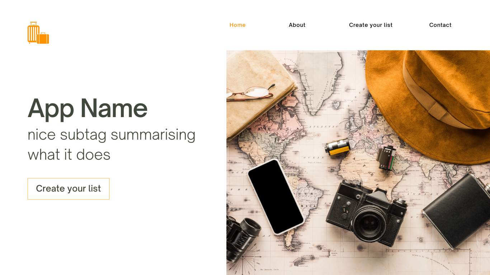
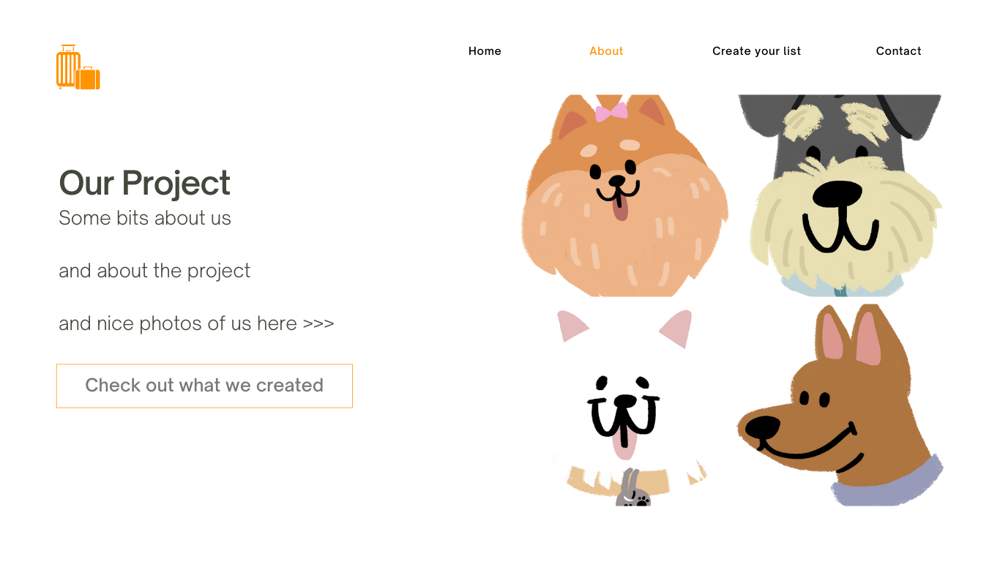
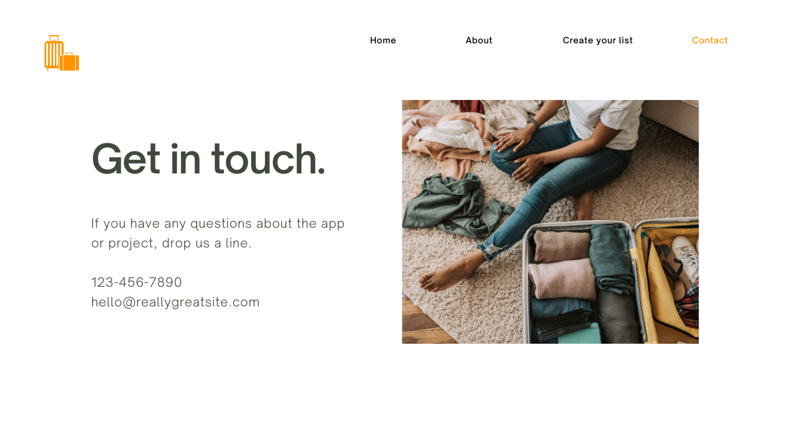

# Homework Week 1

## Team Name: 

## Team members:
- Eilidh Quinn
- Gracialine Ong
- Laura Almond
- Michelle Kim

## Web Application Name:
- Packd
- PackedIt - have you Packedit yet?
- Packr
- PackItIn

## Responses to Questions 1 & 2
### a. What are you building?
We are going to build a React web application for travellers to create and store lists of the things they need to remember to pack for trips. 

We are going to build this app with React and node.js and if we incorporate back end and database features, we will expand this to other technologies like Express, SQL and Firebase.

### b. What does it do or what kind of problem does it solve?
The packing planning web application will be designed to help frequent travellers plan what they need to remember for their trips with ease and simplicity. No more forgetting your passport, suncream or headphones and having to make a last minute trip home or fork out to buy something new while on holiday - time and money is precious when you are travelling!

The packing planning app would be a complimentary addition to Skyscanner’s collection of traveller-first functionality that makes travel simple so that people are empowered to get out and explore what the world has to offer. We plan to create a web application that is aligned to the Skyscanner values of simplicity and user friendly design and functionality.

The Minimum Viable Product (MVP) that we are aiming for with our web application will allow users to create a list for an upcoming trip, add items they need to pack to the list and categorise those items. They will be able to view their items, edit the items, tick them off when they have packed them and delete items if they made an error. They will also be able to delete the full list if they wish. We are exploring different options for storing lists in a database or file.

We have also noted some additional features and functionality that would enhance the application significantly that we will incorporate should we have time and capacity in the project. These extensions are listed in the features section below. 

### c. What are the key features of your system?
### MVP Key Features
A simple four page web application with branding that is centred around simplicity, clean pages and using colours from around the world, aligned to Skyscanner’s branding values. Key features:
- A home page
- An about page with information on the app and our project team 
- A contact us page 
- User can create a list, list categories and list items
- User can add a destination for the list
- User can view the items they have already added
- User can edit categories and items 
- User can tick off completed items 
- User can remove the list category, list item or list itself

### Possible Extensions
- Create an account and log in to store multiple lists
- Sort items based on whether they have been completed or not
- Connect to a weather API for the trip destination to display the current weather forecast
- Option for user to create a ‘favourites’ or ‘basics’ list that can be copied over for each trip so they always have their essentials 
- Suggest items to pack based on weather e.g. umbrella if raining, suncream if over certain temperature, jacket if below a certain temperature
- Holiday destination or type of holiday to impact the images on the web page 
- Drag & drop or move around list items on the page 

### d. Provide a sample architecture diagram of your system 
We have created some sample architecture diagrams of the version of our web application that includes some of the extensions we have listed above. The MVP version of the web application would only include the client browser website in React and some node.js logic. 

These are some sample wireframes of our web application, including for both our MVP and MVP plus extensions versions of the site. Please note these only contain sample and placeholder colours, fonts, text and images, they are just to show an example of how the layout of the web application might look. 

### Homepage

### About Page

### Create your list Page

### Contact Page

We also have pulled together what some of the pages might look like in the web application that includes some of the extensions, so additional features, that we have discussed. 

### Sign Up Page

### Log In Page

### Create your list page with extensions

### e. Describe the team approach to the project work: 
**How are you planning to distribute the workload**

In our first two meetings as a group we discussed our strengths and weaknesses, our availability for dedicated project work over the four week period and confirmed our core project idea. 

Starting on Sunday 24th April, we have been managing the build of this web application by loosely following SCRUM methodologies with each week of the four week project as a one week long sprint. 

Our team will virtually meet twice weekly on Zoom as a minimum:
- Thursday evening: this will be the equivalent of a daily stand-up meeting where we will come together to discuss how we are progressing on our tasks/stories, what blockers or challenges we are coming up against and what our plan is for the next few days.
- Sunday mornings: here we will have a mini sprint review of the past sprint and sprint planning for the upcoming sprint. This time is also set aside for us to work on any larger parts of the project together - if this is required, we will agree the amount of time needed for this at the Thursday meeting a few days prior.

As communication is key to the successful delivery of this web application we also have a Slack Workspace where we keep in daily contact via various dedicated channels for project planning.  This allows the full team to keep up to date with the progress of the project and work around whatever other commitments we have. In this Slack channel, we have bookmarked links to other shared workspaces and accounts e.g. Google Drive, Trello & GitHub.

To support the delivery of this web application our team also has a Trello board. Each member is able to take on tasks and place them in the appropriate column (for example, backlog, doing, blocked or testing). We will use this board as the basis of our sprint review and sprint planning meetings, moving items from the product backlog to the sprint backlog as appropriate. 

Using Trello as the tool, we will evenly distribute the workload.  So for example each Team Member will create one page of the website to give them experience and practice in the relevant technologies. If certain tasks cannot be split to give all members practice then we will come together to work on that section as a team. For example, the core ‘create your list’ page will be a team effort, but we will split this off into individual features and components for team members to work on where appropriate.

**How are you managing your code**

Our team has a shared GitHub repository (https://github.com/Ada-Grace/cfg-groupproject) where all our project files (including markdown, html, css and js files) will be stored.  All team members are collaborators on this repository. 

Each member will use Git in order to pull, branch and push their changes. Instructors will also be added to pull requests as reviewers when required.

**How are you planning to test your system**

Testing will be carried out in various ways. We will create unit tests in order to test our functions and components in the web application. This will allow them to be automated and ensure our functions continue to work as we edit and enhance our functions.

We will also complete some user acceptance testing (UAT) of the web application.  This will be completed by team members and if time allows, by friends and family. Ensuring a diversity of demographic in this will be key. 

