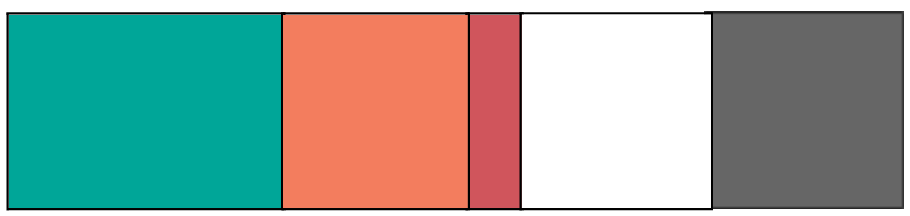
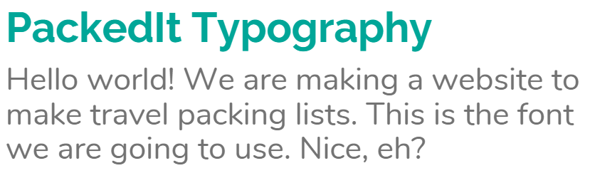

# Homework Week 2

## Team Name: Have you tried restarting?
## Web Application Name: PackedIt

## Team members:
- Eilidh Quinn
- Gracialine Ong
- Laura Almond
- Michelle Kim

## Wireframe of PackedIt
Wireframes to be added here. 

## Design Justifications

## d) Justification of design choice
### General Justifications
All of the design choices we made have been in keeping with the values of keeping things simple and making the user experience as easy and enjoyable as possible, including:
- Clean minimal look with a simple, selective colour palette 
- Separate colours for key tappable and non tappable elements 
- Landing page with clear 'create your list' functionality emphasises the purpose of the site and allows for an immediate start creating the list
- Made starting as easy as possible by adding suggestions in text boxes, categories for quick generation of a list and suggested items for each category
- Logo & brand name on the top left, nav bar buttons at the top right, key creating list functionality down left hand side and bottom right following the stopping points in the Z pattern.
- The MVP of the web app will only have two pages - the first landing page with the clear box to create your list with 'About' and 'Contact' information access via a down scroll or by clicking on the links in the nav bar, which would just scroll down the page. The only other page is the page which you are taken to when you click 'create your list' submit button on the landing page, where you are able to view, edit, add, remove list elements. We will still have these separated out in the nav bar, but when clicked they will just scroll down the page 

## e) Justification of colour choice

To sit alongside clean white backgrounds and white and dark grey text, we have chosen three warm, vibrant and youthful colours to appeal to a young and diverse audience of travellers. 

We borrowed these three colours from Skyscanners brand colour palette which represents and celebrates the beauty and richness of our world. Each colour is named after a place around the globe - this is listed under each colour below in italics.

The warmth of the orange alongside the cool green has an appealing balance due to them being complementary colours, sitting across from one another on the colour wheel. The red also sits complementary to the green, but will be used less in this case as noted below. Combined, the colours are likely to give the user connotations of life, creativity, passion and energy which are all in line with the purpose of the web app to help people travel and explore the world with ease. 

- Primary Colour: Teal Green
    - *Monteverde - named after a town in Costa Rica renowned for its biodiverse forests in the clouds* (Skyscanner place label)
    - Green has connotations of life, freshness and nature
    - this will be our main logo colour
- Main Additional Colour: Burnt Orange
    - *Buñol - named after a town in Valencia, Spain, known for its yearly tomato throwing festival, La Tomatina* (Skyscanner place label)
    - Orange has connotations of innovation, creativity and joy
    - this will be the colour used for tappable buttons and features
- Other Additional Colour: Red Pink
    - *Panjin - named after Red Beach, in China’s Panjin Shi, which is known for its deep red Chenopodium marshes* (Skyscanner place label)
    - Red with these pink tones has connotations of love, passion and energy
    - Although we are aware that red also has connotations of danger and warning, so this colour will be used minimally and in appropriate places.
- Background Colour: White
    - We also have some light/off white versions of our three colours prepared in case we want to use them also for e.g. highlighted boxes
- Typeface Colour: A soft grey
    - Chose a dark but soft grey over a simple black as we are aware that pure black on white can lead to eye strain due to 100% contrast - we don’t want our website to be difficult to read!
    - White text will be used on some of the darker colours above

## Logos
We have created variations of a simple logo for use throughout the site. 

The logo has the shape of a suitcase easily recognisable as a symbol for travelling and packing, with a tick in the middle indicating the web app is about 'checking' things off and having everything needed for a trip.

Additionally we have gathered some imagery of travelling and packing that has hints of these colours so that all visuals in the site are in keeping with this colour theme.

## Buttons & Rounded Edges
We have opted to go for soft rounded edges on any icons, buttons and other shapes. The research tells us that rounded edges take less cognitive effort to visually process and they are also effective content containers because they almost point inward towards the center. 

Our buttons will be for key actions like ‘create a list’ and we will use smaller symbols for other simplified actions like ‘add’ (+) or ‘delete’ (a bin symbol). We will use high contrast for positive actions and likely orange as it is the most visible colour after red but without the negative connotations and emotions that come with it.

To account for usability of viewing this web app in a browser on a mobile device, we will ensure that buttons are between 38-52px so that they can be easily used by touching with a fingertip.

## Typography

We have chosen two Sans Serif fonts which again, due to their rounded edges, take less cognitive effort to process and have an approachable and fun feel to them. 

We have chosen Raleway as our heading font and Nunito as our body font. We will ensure that all font is 16 pixels or larger as is standard for body copy in modern web design. 

## f) Design heuristics
We have pulled together a matrix to demonstrate at a glance how the key design decisions we have made meet both Norman and Neilson's design principles in different ways. The columns in the tables refer to:
- Logo: the choice of our logo as an easily recognisable symbol of travel with a check/tick in the middle indicating completion or a list
- Font: the choice of simple fonts with rounded edges
- Icons: the use of easily recognisable icons and symbols throughout the site
- Layout: the simple layout that reduces information overload and allows the user to move through the site with ease and clarity of what is expected
- Copy: the text copy throughout the website that prompts the user to take action and aids in understanding the purpose of what is being asked

There are notes below these tables which provide some more depth and context.

## Norman Design Principles/Heuristics
|  Design Principle                                    | Logo | Font | Icons | Layout  |  Copy  |
|---|:---:|:---:|:---:|:---:|:---:|
| Use both the knowledge in the world and in the head  |  x   |      |   x   |    x    |        |
| Simplify the structure of the task                   |      |      |   x   |    x    |    x   |
| Make things visible                                  |      |      |   x   |         |        |
| Get the mappings right                               |      |      |   x   |    x   |    x   |
| Exploit the power of constraints, both natural and artificial |      |       |   x   |        |   |
| Design for error                                     |      |      |       |    x    |   x    |
| When all else fails, standardise                     |      |      |   x   |    x    |        |

#### 1. **Use both the knowledge in the world and in the head:** 
*Make use of what the user already knows to reduce their mental load!
Make it natural! We’ll explore this later, but think something like language; english readers scan left to right, but arabic readers may scan right to left instead (the language is right-to-left instead!)*
- We have ensured that any iconography and imagery throughout the site is easily identifiable and recognisable with real world objects and symbols so that users existing knowledge is used to navigate the site
- The key functionality and key points will also be read left to right as the site will be read in English

#### 2. **Simplify the structure of the task:** 
*Ensure that the structure is simple - for example, cut down on the number of steps something may have.*
 - Steps to create a list is minimal. We have included suggested categories to reduce the need for extensive user input or imagination to come up with these themselves. 
 - We have provided an item name for each form item, as well as prompts in any text boxes, to reduce any question marks around what is being asked.
 - We have made the core function of the website visible up front so the user does not need to hunt through the website to find this.

#### 3. **Make things visible:** 
*Ensure that components or function that a user will need is visible - otherwise, the user has to spend time looking (annoying) and may not know what to do next.  But make visible only the stuff that matters. For example, on a log-in screen, we only need logging components - anything else is just clutter!*
 - The list page will have the categories listed on the left hand side no matter where they are in the list.  This makes them easy to find.
 - The first thing the user lands on is the form used to create a list so this won't need to be searched for in another page.

#### 4. **Get the mappings right:** 
*Ensure that the effect a component has matches its control (e.g. how a left arrow represents usually movement for going back, a button should similarly match this level of direct mapping)*
- we are using simple iconography e.g. plus (+) sign for adding items, a bin or cross symbol for deleting, a tick for when something has been completed or checked off

#### 5. **Exploit the power of constraints, both natural and artificial:** 
*Place constraints and arrange components in a way that the user is naturally is guided to them themselves - they don’t have to remember where the back button is this way 
For example like how most back buttons are usually located on the top-left of the screen / associated with left (e.g. iOS, swipe left for back. Most back movements have a left-directed button)*
- The 'tick' option sits on the left hand side of each item which is standard for regular to do list apps and manual to do lists that already exist

#### 6. **Design for error:** 
*Assume that users will make an error at some point, and plan accordingly*
- we allow the user to edit or delete a list item or a list category, and there are no constraints on what type of content they put in here - e.g. any numbers, text or symbols are allowed, so no value errors will be thrown

#### 7. **When all else fails, standardise:** 
*Use standard icons, or follow other standard conventions*
- we have used standard icons for adding to an item (plus symbol), deleting an item (rubbish bin or cross)
- we have used quite a standard website layout with logo in top left hand corner, nav bar on the top right hand side 

## Nielsen Design Principles/Heuristics

|  Design Principle                                    | Logo | Font | Icons | Layout |  Text  |
|---|:---:|:---:|:---:|:---:|:---:|
| Visibility of system status                          |      |      |       |    x   |   x    |
| Match between the system and the real world          |      |      |   x   |        |   x    |
| User control and freedom                             |      |      |       |    x   |   x    |
| Consistency and standards                            |      |      |   x   |    x   |        |
| Error prevention                                     |      |      |       |    x   |   x    |
| Recognition rather than recall                       |      |      |   x   |    x   |   x    |
| Flexibility and efficiency of use                    |      |      |   x   |    x   |   x    |
| Aesthetic and minimalist design                      |  x   |   x  |   x   |    x   |        |
| Help users recognise, diagnose and recover from errors|     |      |       |        |   x    |
| Help and documentation                               |      |      |   x   |        |   x    |

#### 1. **Visibility of system status:** 
*Users should be aware of what’s going on at all times to prevent them feeling lost.*
- The nav bar headings will be highlighted when a user is on this page, which will make clear what page they are on at all times 

#### 2. **Match between the system and the real world:** 
*Speak what the user already knows - discard jargon and make use of languages / actions the user is already familiar with from the real world.*
- simple plain English is used on the instructions.  Destination etc. and includes hints where data is required.  Buttons are clearly labelled with action verbs to ensure the user easily understands what it does.
- Icons and images used are easily recognisable in the real world

#### 3. **User control and freedom:** 
*Users may make mistakes.Give them the ability to navigate elsewhere or have the freedom to escape - in essence, maximise the control a user has.*
- we allow the user to edit or delete a list item or a category, or even just go back to the start to begin again 

#### 4. **Consistency and standards:** 
*Do not differ - follow industry conventions. Jakob’s Law argues that people spend most of their time on other websites, so follow what already exists so that users don’t feel confused by something entirely new.*
- the design is similar to other popular well designed websites.  It is clear what the function of the website  is as soon as the user lands on the page.

#### 5. **Error prevention:** 
*Account for human errors or unexpected situations, and place safeguards.*
 - The trip destination and title will be mandatory.  Date of travel will also be mandatory as this data is used in the API weather call in the extension feature.  The date will be selected from a month and a year (no free text).

#### 6. **Recognition rather than recall:** 
*Minimise memory load by making components easily usable and familiar (e.g. no need to remember anything)*
- any actions that the user can do are easily identifiable and comunicated using simple icons.  The user does not need to navigate or do multiple clicks to do any of the tasks.

#### 7. **Flexibility and efficiency of use:** 
*Experienced users should have the ability to speed up interaction (e.g. ‘Skip’ button!).*
- When creating a list a user can pre-select a number of suggested categoreis.  This will set up the categories within the list, saving the user time and effort (as they do not need to use them manually).

#### 8. **Aesthetic and minimalist design:** 
*All pieces of information compete for the users attention. Minimise pieces shown to prevent information overloads or clashes.*
- We have limited our use of colours to three.  We will also use seperate colours for tappable/clickable and non tappable/non clickable elements.
- Our buttons are rounded as rounded buttons take less cognitive effort to visually process than square buttons.  They are effective as the 'point inward' towards the centre.
- We are using a simple sans-serif font: Raleway for headings and Nunito for text.

#### 9. **Help users recognise, diagnose and recover from errors:** 
*When errors are shown, abstract the message to a degree that it’s easy for a user to recover (make it a easy-to-understand error message that tells the user how to fix the issue / what to do next).*
- If a user doesn't include any of the key requirements e.g. list name, destination or date, we will create an easy to understand error message that tells them how to fix the issue and what to do next 

#### 10. **Help and documentation:** 
*Systems shouldn’t ordinarily need additional explanation, but in cases they do there should be some documentation available to help the users gain understanding (e.g. like an information kiosk).*
- Where required we will have 'hints' to explain to the user what data we are expecting them to input.

