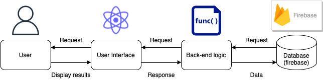
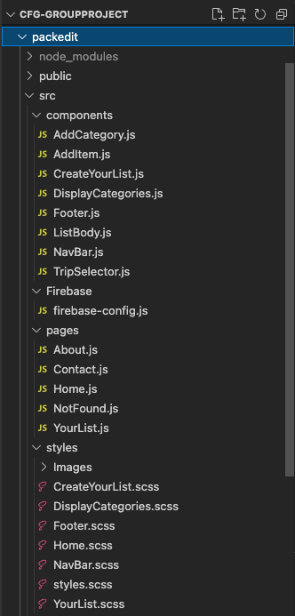
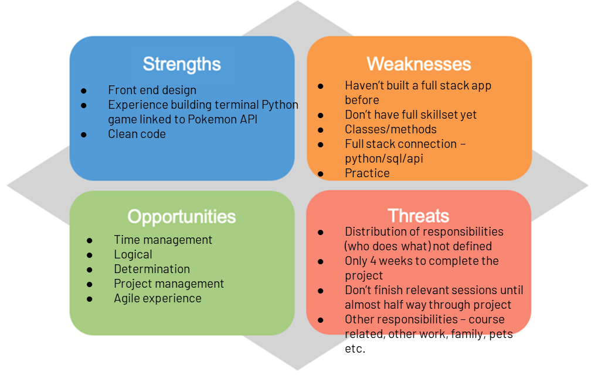
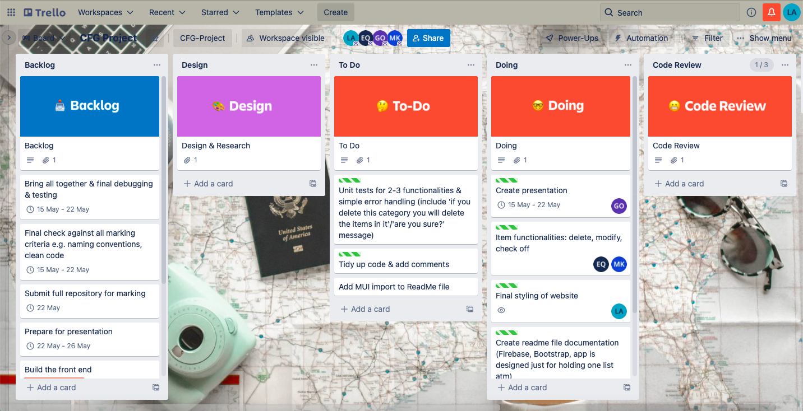

<h1 align="center"> CFG Spring Nanodegree 2022 Group Project Report  </h1>

  

 created by 

<h2 align="center"> "Have you tried restarting?" </h2>

 
<h2> Team members: </h2>
<ul>  
<li> Eilidh Quinn
<li> Gracialine Ong
<li>Laura Almond
<li> BoGyeong Kim
</ul>

<h2>Roadmap of Report</h2>
<ol>
<li> Introduction
<li> Background 
<li> Specifications and Design
<li> Implementation and Execution
<li> Testing and Evaluation
<li> Conclusion
</ol>

 
<h1> 1. Introduction </h1>

This report explains how we approached PackedIt, our Full Stack specialisation final project.

<h2>Aims and objectives of the project</h2>

 The aim of this project was to build a complete, functional and user friendly web application in React. We aimed to build a web application called <b>PackedIt</b> which travellers can use to create and store lists of the items they need to remember to pack for trips.

 In order to meet our aims and objectives we set out with the mission that our app must allow users to:

<ol>
<li> create a packing list which takes in a list name, destination and date of travel.
<li> add personalised categories.
<li> add items, mark an item as packed/complete and delete an item or modify an item.
</ol>

In addition to these aims and objectives for the usability of PackedIt, we had to work to implement the knowledge gained on our Code First Girls course in React, JavaScript, HTML & CSS, as well as incorporate other libraries or technologies where appropriate. 

<h1> 2. Background </h1>

PackedIt has been designed to help frequent travellers plan what they need to remember for their trips with ease and simplicity. No more forgetting your passport, suncream or headphones and having to make a last minute trip home or fork out to buy something new while on holiday - time and money is precious when you are travelling!

PackedIt would be a complimentary addition to Skyscanner’s collection of traveller-first functionality that makes travel simple so that people are empowered to get out and explore what the world has to offer. We have created a web application that is aligned to the Skyscanner values of simplicity and user friendly design and functionality.

PackedIt allows users to:
<ul>
<li> create and view multiple lists for different trips, each stored in a database
<li> enter a list name, a destination and a date of travel for each list which is then displayed on the 'Your List' page
<li> select which list they would like to view within the 'Your List' page via a drop down
<li> select pre-defined categories to start and add as many personalised categories as they wish within each list
<li> add as many items as they wish within each category
<li> mark items as packed or delete an item if it is no longer wanted or they made a mistake
</ul> 

<h1> 3. Specifications and Design </h1>

<h2> 3.1 Stack, Tools & Libraries </h2>

 Our application was built using ReactJS.  We also installed a number of other packages to help with the styling as well as the back-end database. 

We also used:
<ul>
<li> React Bootstrap (including sass) to improve our UI & UX and create components and features that were consistent and user friendly
<li> Material UI to improve our design, as with React Bootstrap
<li> Firebase Firestore as a persistence layer to read and write data for any list created
</ul>

We have created a simple four page web application with branding that is centred around simplicity, clean pages and using colours from around the world, aligned to Skyscanner’s branding values. 

<h2> 3.2 Requirements </h2>

When designing our web application we agreed on a set of features which would make up our Minimum Viable Product (MVP).  We also included a number of extensions that we would have liked to implement if time allowed.  However, our MVP meets all the aims of the project.

Features that we were successful in implementing:
<ul>
<li> A home page with a form where users can create their list.
<li> An about page with information on the app and our project team.
<li> A contact us page.
<li> User can 
<ul>
<li> create multiple lists (exceeded MVP to create just one list).
<li> add a list name (not mandatory).
<li> add a list destination (not mandatory).
<li> add a trip date (not mandatory).
<li> delete a list.
<li> create a category.
<li> delete a category.
<li> create an item.
<li> view items, categoryies & lists already added.
<li> mark an item as packed.
<li> delete an item.
</ul>
</ul>

Additionally, we included a couple of things that were not in our MVP but add value to our app, including:
<ul>
<li> alt text on images and ids on form input for accessibility.
<li> a 'Page not found' page which is displayed if the user tries to visit a page that does not exist. 
<li> a modal alert box that warns a user when they are about to delete their entire list.
</ul>

Further features and extensions that we would have liked to have implemented:

<ul>
<li> Creating a log in system for users that connects to Firebase Firestore.
<li> Editing the names of individual list items, categories & list details after creation.
<li> Sort items based on whether they have been completed or not.
<li> Connect to a weather API for the trip destination to display the current weather forecast.
<li> Option for user to create a ‘favourites’ or ‘basics’ list that can be copied over for each trip so they always have their essentials.
<li> Suggest items to pack based on weather e.g. umbrella if raining, suncream if over certain temperature, jacket if below a certain temperature.
<li> Holiday destination or type of holiday to impact the images on the web page. 
<li> Drag & drop or move around list items on the page.
<li> Optimisation of the app for mobile devices.
</ul>

<h2> 3.3 Design </h2>

 All of the design choices we made have been in keeping with the values of keeping things simple and making the user experience as easy and enjoyable as possible, including:
<ul>
<li> Clean minimal look with a simple, selective colour palette 
<li> Separate colours for key tappable and non tappable elements 
<li> Landing page with clear 'create your list' functionality emphasises the purpose of the site and allows for an immediate start creating the list
<li> Made starting as easy as possible by adding suggestions in text boxes and categories for quick generation of a list
<li> Logo & brand name on the top left, nav bar buttons at the top right, key creating categories functionality down left hand side and bottom right following the stopping points in the Z pattern.
</ul>

To sit alongside clean white backgrounds and white and dark grey text, we chose two vibrant and youthful colours to appeal to a young and diverse audience of travellers. 

The logo has the shape of a suitcase easily recognisable as a symbol for travelling and packing, with a tick in the middle indicating PackedIt is about 'checking' things off and having everything needed for a trip.

Additionally we used imagery of travelling and packing that has hints of these colours so that all visuals in the site are in keeping with this colour theme.

We opted to go for soft rounded edges on any icons, buttons and other shapes. The research tells us that rounded edges take less cognitive effort to visually process and they are also effective content containers because they almost point inward towards the center. 

We chose two Sans Serif fonts (Raleway and Nunito) which again, due to their rounded edges, take less cognitive effort to process and have an approachable and fun feel to them. 

We used Figma for developing our wireframes and prototypes, as well as Canva brand tools for creating logos and the presentation for the project, importing all of our chosen colours and fonts for ease of use.

<h2> 3.4 Architecture </h2>

PackedIt is built with ReactJS connecting to Google's Firebase for the back-end database.  We used React functional components with Hooks useState and useEffect throughout the app. Below is a simple diagram of our architecture:

  

<h2> 3.5 File Structure </h2>

We split out every component into it's own component.js file and these were all saved within the components folder. We also had seperate js file for each page, where components were imported into.  Style sheets were also split out where appropriate.  See screenshot below for a glance at our overall file structure:

  

<h1> 4. Implementation and execution </h1>

<h2> 4.1 Development approach and team member roles</h2>

In our first two meetings as a group we discussed our strengths and weaknesses, our availability for dedicated project work over the four week period and confirmed our core project idea. 

Below is our team's SWOT analysis from our first meeting as a full group.  As can be seen from this, a lot of technology we used to create PackedIt was brand new to us and it was a steep learning curve. However, it also offered us the opportunity to learn and work together as a team to deliver our final project.

  

Team member roles changed over the course of the project based on availability and other work, family and education commitments, planning each week ahead at the Sprint Planning sessions on Sunday mornings and reviewing progress at the 'stand up' on a Thursday evening. The team worked together to review key documents and make final decisions based on individual progress (for example design decisions).

To ensure collaboration and consistency we used a shared GitHub repository to store our code.  This allowed different team members to work on different branches at the same time and then at the appropriate time merging these into the main branch.  Branches were only merged after a branch was working and the full team agreed to merge it into the main branch.  This ensured our main branch was always the latest most up to date working version of our project.

<h2> 4.2 Implementation process, achievements and challenges</h2>

In summary, our four sprints took the rough approach of:

<ul>
<li> <b>Sprint/Week 1</b> - Finalising all requirements, project set up including GitHub, Slack, Trello etc., learning React & planning design and architecture of overall site
<li> <b>Sprint/Week 2</b> - Developing UI & UX design and wireframes on Figma, overall site navigation and setting up initial React App with file structure
<li> <b>Sprint/Week 3</b> - Developing core list functionality including connecting to Firebase, website navigation and basic design and styling
<li> <b>Sprint/Week 4</b> - Finalising core list functionality, pulling together all project documentation and final design and styling
</ul>

Throughout this project we have worked well together to produce our final project app PackedIt.  This has been achieved through collaborative working, providing prompt and honest feedback on individual or small group tasks and everyone in the team understanding the goal of the project.

 However, this has not come without challenges, as was to be expectd at the start. A few challenges we faced, lost some time on but ultimately overcame were:
<ul>
<li> <b>Scroll navigation</b> - we initially intended on having a one page scroll navigation but due to the complexity of this, we choose to focus our efforts on having a fully functioning packing list which would have greater benefit for the end user.
<li> <b>Data structure</b> - figuring out the correct data structure of our lists, to include child objects of categories, and their child objects of individual list items, proved to be a significant challenge. We explored various options for each element including arrays, lists and subcollections in Firebase and even looked at holding each object separately and allowing the app to only hold data on one full list. In the end, we prioritised storing the items in one nested and connected object. However, accessing the categories and items within our lists in this structure was then a significant challenge in itself.
<li> <b>Modifying or Editing item names</b> - one particular issue that we have so far been unable to solve, as a result of the above nested data structure, is being able to edit the item name, this is very nested. However, we prioritised being able to access this element to check it off as 'packed' and to delete it, so others could be added in it's place.
<li> <b>Firebase Quotas</b> - we experienced issues with Firebase quota limits when we first connected it to our app. This was due to our app 'spamming' firebase with post requests via an error in our use of Use Effect. We resolved this and were able to fully utilise Firebase from then on, but we did lose some time to this issue. 
<li> <b>Stack</b> - with most of us being very new to React, we were reluctant initially to incorporate any back end or database due to the steep learning curve we were already on. However, a member of the group had a bit of experience in using Firebase and we ended up part way through the project implementing this as our persistence layer. Unfortunately, we didn't realise before making this connection that it would mean rewriting or adapting much of the code and logic that had been developed already. However, we agreed that the benefit of using Firebase outweighed this.
</ul>

<h2> 4.3 Agile development</h2>

We approached the project in an agile way, loosely following SCRUM with each week being a week long sprint.  We held two weekly virtual meetings:
<ul>
<li> Thursday evenings we met at 18:00 for a quick 'stand-up' to discuss our progress on tasks, what our plans were for the next day or two and to discuss any key issues that had popped up.
<li> Sundays we met at 10:30 for a longer meeting loosely combining a sprint review with a sprint planning session. Here, we made decisions on any issues that popped up, discussed what the plans were for the following week, showed features that had been implemented as well as working on any larger parts of work that required us all to contribute.  Sometimes this included doing paired programming via Visual Studio Code Live Share extension.
</ul>
 
 

We also kept in touch throughout the project development on Slack via various dedicated channels. This allowed the full team to keep up to date with the progress of the project and work around whatever other commitments we had.  This space had links to all of our other key shared workspaces and accounts e.g. Google Drive, Trello, GitHub & Figma.

 To support the delivery of the project we also had a Trello board. We used this as the basis of our sprint review and sprint planning meetings.  Items were placed in order of priority so it was clear which parts we should work on first.  Each member was able to take on tasks and place them in the appropriate column (for example, backlog, doing, blocked or testing).  This also allowed team members to assign themsleves tasks based on skill and availability.

  

<h1> 5. Testing and evaluation </h1>
<h2> 5.1 Testing strategy </h2>

We took an ongoing approach to manual testing, with team members only pushing code when errors or bugs had been fixed. We came together via Slack and in our predefined meetings to work on any larger and trickier errors, or to test a new feature fully together.

As developers, we used a mix of Mac and Windows operating systems and different browsers, so this was helpful in understanding compability across devices and browsers.

We frequently refactored our code to find better ways of structuring it for readability and sustainability, trying not to shy away from change when it was necessary to improve the project.

This included also occassionally doing code reviews of new features or pages that other team members had implemeneted to check for mistakes, naming conventions and different ways of doing.

<h2> 5.2 Functional and user testing </h2>

We struggled with the implemenation of unit testing due to the connection with Firebase making this quite complex and this being an entirely new area for each team member. However, we have included some simple unit tests in our project and we manually tested significantly throughout and at the end of our project.

We did some user acceptance testing with a couple of selected family and friends who we let use the desktop application as we observed and gathered their questions and feedback at the end. This process was reassuring in that users liked the design and simplicity of the site, and we were encouraged to hear our ideas for extensions and further developments echoed in their feedback.

<h2> 5.3 System limitations </h2>
As noted at the moment in our ReadMe file, the app uses one Firebase database as it doesn't have the user account or login feature yet. This would be first priority in any future development to ensure user privacy and safe storage of their data. 

Additionally, we focused on optimisation of this app for the web, so there are limited mobile device considerations and therefore it may not be as accessible as we would like it to be.

The app is currently not hosted anywhere and does not have any offline availability, so this is a limitation.

However, for the purposes of this project, we are pleased with the result.

<h1> 6. Conclusion </h1>

Ultimately, in spite of the hurdles and the learning curve for all, we managed to come together as a team, virtually, to create a complete, user friendly and functioning web application that could be beneficial for travellers and organisation friends alike!

As individual team members, we all developed our software development skills in new and existing areas, all the while experiencing a real life Software Development Life Cycle for the first time.

The next steps for PackedIt would be to implement the user account and login feature as top priority, and then explore other valuable extensions like a 'favourites' list and connection to a weather API for their trip destination.

