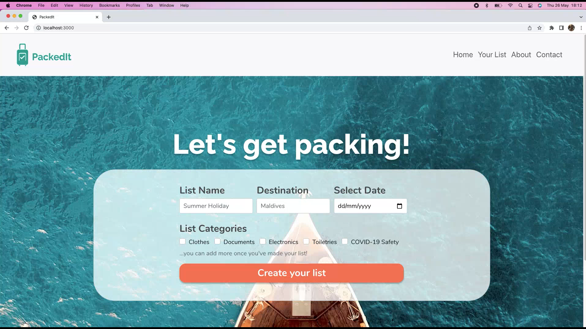
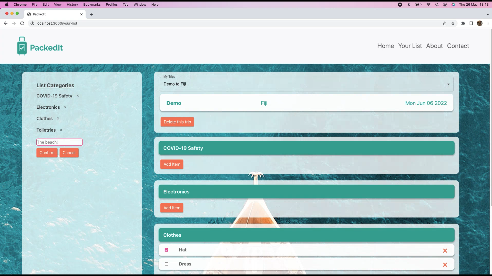

# PackedIt - Trip Packing React Web App
## Created by team 'Have you tried restarting?'
## as part of Code First Girls Full Stack Degree final project

### **PackedIt Overview**
PackedIt is a React web application for travellers, like you, to create and store lists of the things you need to remember to pack for your trips.  It is designed to help you plan what you need to remember for your trips with ease and simplicity.  You can create multiple lists for your upcoming trip by adding items to individual categories. You can view your items in each category and tick them off once you've packed them.  If you make an error you can also delete any of your items, categories, or even the full list. 

### **Who created it:**
This web application was created by Eilidh Quinn, Gracialine Ong, Laura Almond and BoGyeong Kim as part of our final project for our CodeFirstGirls Full Stack Degree (Spring 2022).  

### **Installing and using PackedIt**

1. Clone the files in this repository to your local respository, or alternatively fork this repository to make a copy.
2. Ensure you navigate in your terminal to the 'packedit' folder.
3. Install React Bootstrap by running this in your terminal: <code>npm install react-bootstrap bootstrap</code>
4. Install MUI by running this in your terminal <code>npm install @mui/material @emotion/react @emotion/styled</code>
5. Install Firebase by running this in your terminal: <code>npm install firebase</code>
6. Start the application by running this in your terminal: <code>npm run start</code>

Once you have the application running locally you can create a list via the Create Your List form on the home page, then view your lists in the Your List page. Here, you can add and delete items and categories.

Please note, if you wish to see the backend database structure, the team will need to add you to the Firebase database.

**Please note that at the moment anyone using this app will be using the same database until a sufficient login and user account system is implemented. Please be aware of this when creating your lists.**

